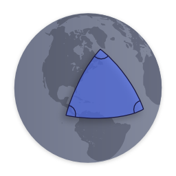

# Spherical Geometry Library &middot; [](https://travis-ci.com/NotWoods/spherical-geometry-js) [](https://www.npmjs.com/package/spherical-geometry-js) [](https://www.npmjs.com/package/spherical-geometry-js)

This library provides classes and functions for the computation of geometric
data on the surface of the Earth.

This library ports a small but useful subset of classes from the Google Maps
Javascript API version 3, to use as a separate module or in node. I also try to
have readable code, so that you can understand what calculations are being made.

## How to use

```javascript
import * as geometry from 'spherical-geometry-js';
```

Or import individual modules

```javascript
import { computeArea } from 'spherical-geometry-js';
import computeArea from 'spherical-geometry-js/compute-area';
```

Notes:

-   The API is nearly identical to the Google Maps Javascript API.
-   Functions automatically convert coordinate objects into `LatLng`s. See
    [`convertLatLng`](#convertlatlnglike--latlng) for more details.
-   All computed lengths are returned in **meters**.

## API

**The full API of the library is
[described in the typings file](./index.d.ts).**

Classes and libraries ported from the Google Maps Javascript API:

-   [google.maps.geometry.spherical](https://developers.google.com/maps/documentation/javascript/reference/geometry#spherical)
-   [google.maps.LatLng](https://developers.google.com/maps/documentation/javascript/reference/coordinates#LatLng)

This module tries to maintain full API compatibility with Google Maps so it can
be used as a drop-in replacement.

For convenience, `LatLng` includes some extra methods.

```javascript
const latlng = new LatLng(123, 56);
// Alias getters for longitude and latitude

latlng.x === latlng.lng();
latlng.y === latlng.lat();

latlng[0] === latlng.lng();
latlng[1] === latlng.lat();
```

```javascript
import { equalLatLngs } from 'spherical-geometry-js';

equalLatLngs(latlng1, latlng2) === latlng1.equals(latlng2);
```

### convertLatLng(like) ⇒ `LatLng`

```javascript
import { LatLng, convertLatLng } from 'spherical-geometry-js';

convertLatLng({ lat: 123, lng: 56 }).equals(new LatLng(123, 56));
convertLatLng([56, 123]).equals(new LatLng(123, 56));
convertLatLng({ x: 56, y: 123 }).equals(new LatLng(123, 56));
```

Helper function that tries to convert and object into a `LatLng`. Tries a few
different methods:

1. If `instanceof LatLng`, clone the object and return it.
2. If it has `lat` and `lng` properties...

    2a. if the properties are functions (like Google `LatLng`s), use the `lat()`
    and `lng()` values as latitude and longitude.

    2b. otherwise get `lat` and `lng`, parse them as floats and use them.

3. If it has `lat` and _`long`_ properties, parse them as floats use them.
4. If it has `lat` and _`lon`_ properties, parse them as floats use them.
5. If it has `latitude` and `longitude` properties, parse them as floats use
   them.
6. If it has number values for `0` and `1` (aka an array of two numbers), use
   `1` as latitude and `0` as longitude.
7. If it has `x` and `y` properties, try using `y` as latitude and `x` and
   longitude.
